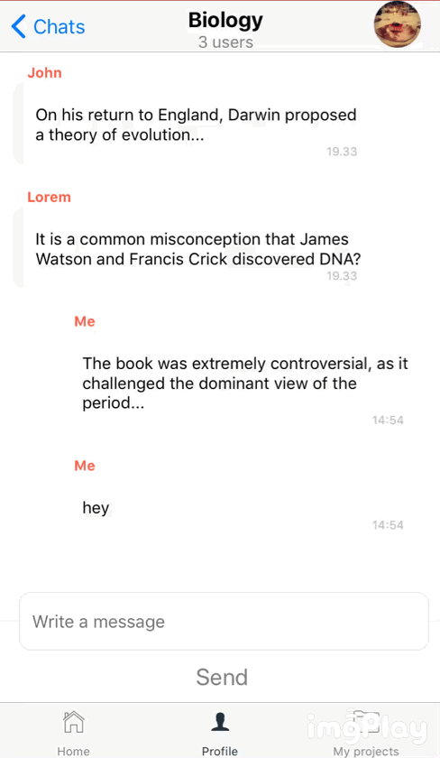

# ChatPage
A simple chat screen created with react-native.

## Prerequisites
Libraries:
```javascript 
import React from 'react';
import { StyleSheet, video,ListView, KeyboardAvoidingView, ScrollView, fontWeight, Image, backgroundColor, Text, fontFamily, fontSize, View, Button, TouchableHighlight, TextInput, TouchableOpacity, Alert,} from 'react-native';
import {RkAvoidKeyboard, RkButton, RkTextInput} from 'react-native-ui-kitten';
```



# Usage
The screen has a header with back button, group name or username, user image, chat balloons, text input, send button.
On send message, the page automatically scrolls down. 

# Built with
React Native

